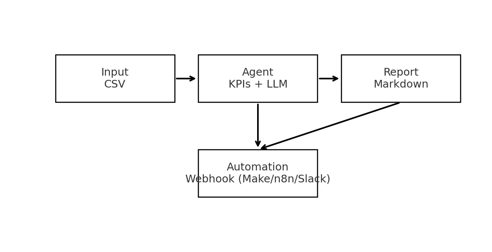

# Financial Analysis Agent — Product Demo

This repository demonstrates how to combine **AI agents** and **automation**
to transform raw financial data into actionable insights and integrated workflows.

**Workflow**
```
CSV → Agent (KPIs + LLM) → Report (Markdown) → Automation (Slack/Notion/Make)
```


## What it does
- Ingest a CSV of financial records
- Compute **KPIs** and (optionally) enrich with a **real LLM** via LangChain
- Generate a human-friendly **Markdown report**
- Push results to a **webhook** (Make/n8n/Slack) and optionally create a **Notion** page

## Why this matters
This demo illustrates how **IA + automation workflows** can simplify complex processes,
a mindset that directly applies to product roles focused on innovation and efficiency.

## Quickstart
```bash
python -m venv .venv && source .venv/bin/activate   # Windows: .venv\Scripts\activate
pip install -r requirements.txt

# Optional: enable integrations
export OPENAI_API_KEY="..."                 # use a real LLM via LangChain
export WEBHOOK_URL="https://example.com/webhook"
export NOTION_TOKEN="secret_..."
export NOTION_PARENT_PAGE_ID="..."

python demo.py
```

## Notebook demo
Open **`notebooks/demo.ipynb`**. It follows a **4-step product flow**:
1) Load sample data  → preview input  
2) Run the Agent     → KPIs + AI narrative + recs  
3) Generate report   → Markdown + saved file  
4) Trigger automation→ webhook + optional Notion

## Features
- **Real LangChain pipeline** when `OPENAI_API_KEY` is set
- **Export to Notion** with `NOTION_TOKEN` + `NOTION_PARENT_PAGE_ID`
- **Metrics** appended to report (latency/tokens where available)
- **Tests** with `pytest` (`tests/test_agents.py`)

## Tech stack
- Python · Pandas · Requests · PyTest
- LangChain + OpenAI (optional)
- Webhook (Make/n8n/Slack), Notion API
